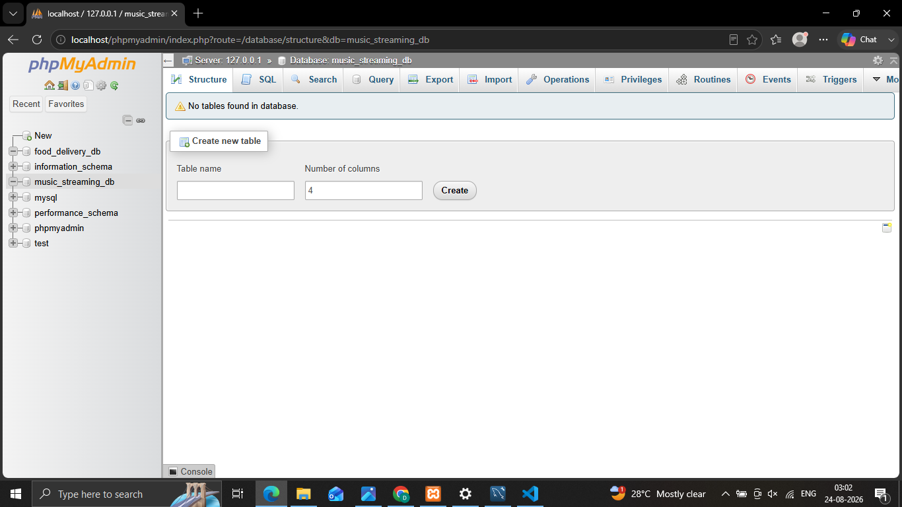

## Install MySQL Community Server on your computer and take a screenshot of the MySQL installer completion window.

'''
 .png>)
'''

## Open MySQL Workbench or DB Browser, connect to your local MySQL server, and create a new database called music_streaming_db.

**Syntax**
'''
 CREATE DATABASE music_streaming_db;

 .png>)
'''

## Write the SQL command to create a new database named food_delivery_db and execute it in your SQL Workbench or DB Browser.  <em><strong>Hint:</strong> Use the CREATE DATABASE statement.</em>

**Syntax**
'''
 CREATE DATABASE food_delivery_db;

 
'''

## List 3 differences between MySQL and PostgreSQL in terms of features or use cases, and give one example of a popular app or company that uses each.

 '''
  **3 Differences Between MySQL and PostgreSQL :**

| Difference | MySQL | PostgreSQL |
|---|---|---|
| **1. Common use cases** | Often used for websites, content-management systems, and applications focused on fast read operations. | Often used for complex business applications, analytics, and systems requiring advanced queries. |
| **2. Features** | Emphasizes simplicity, speed, and ease of use for standard relational database tasks. | Offers advanced features such as custom data types, window functions, table inheritance, and extensions like PostGIS. |
| **3. Data support** | Supports relational data and JSON, with broad availability through web-hosting providers. | Provides strong SQL compliance and extensive support for JSON, arrays, full-text search, and geospatial data. |

 **Examples :**

- **MySQL:** WordPress uses MySQL to store posts, users, comments, and website settings.
- **PostgreSQL:** Instagram uses PostgreSQL to manage application data.
 '''

