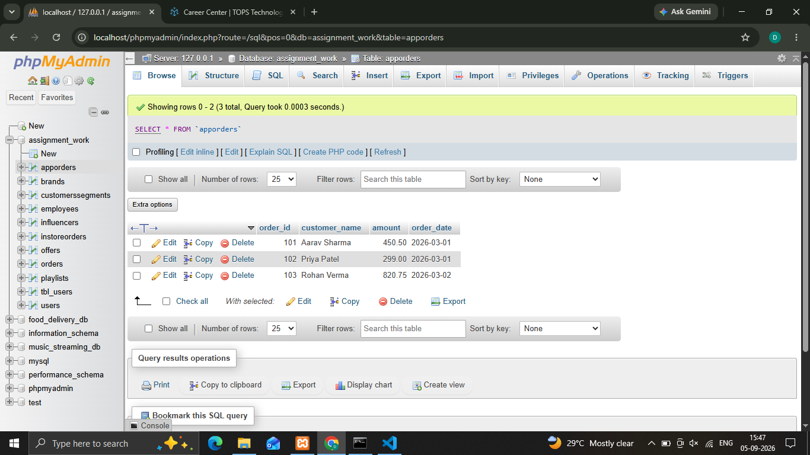
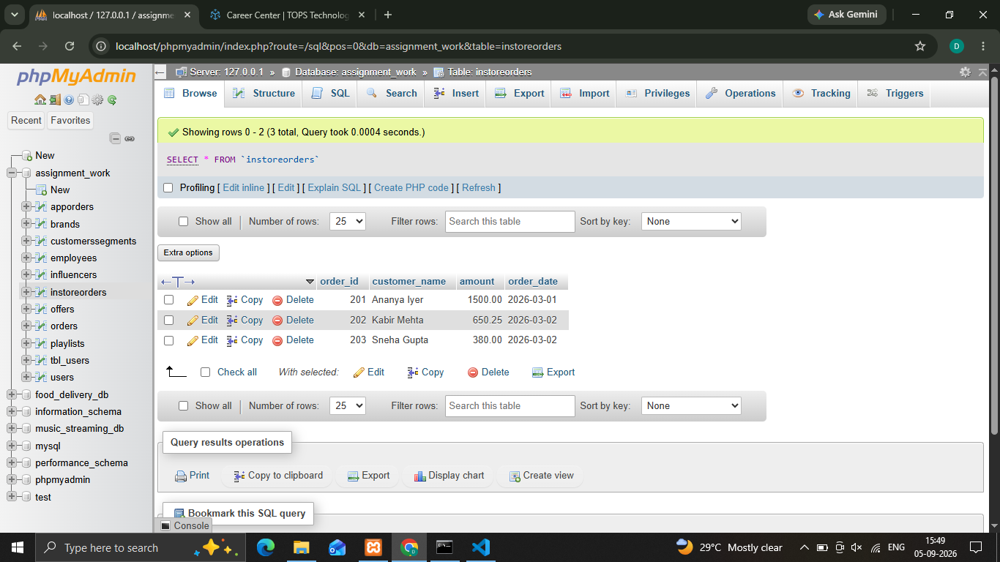
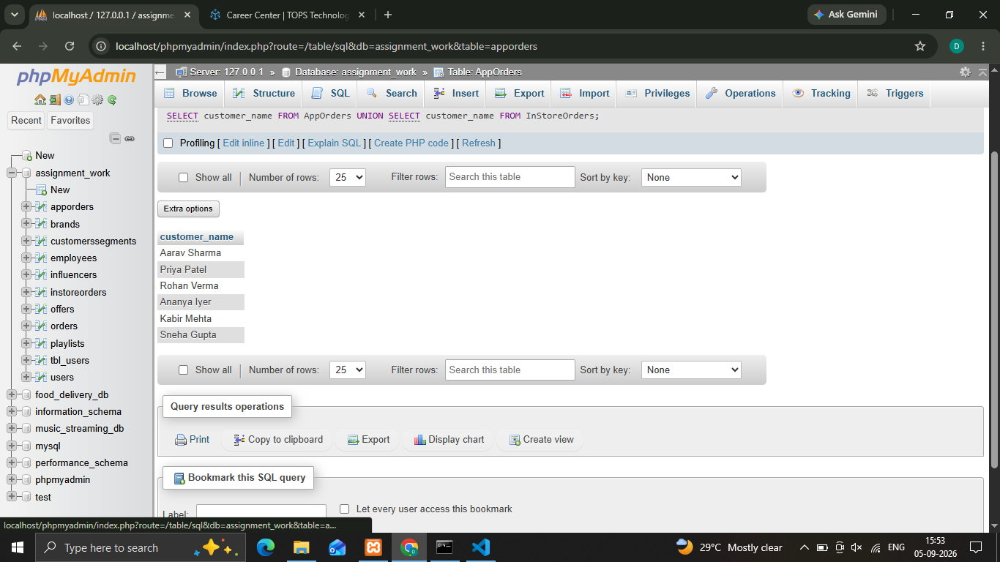
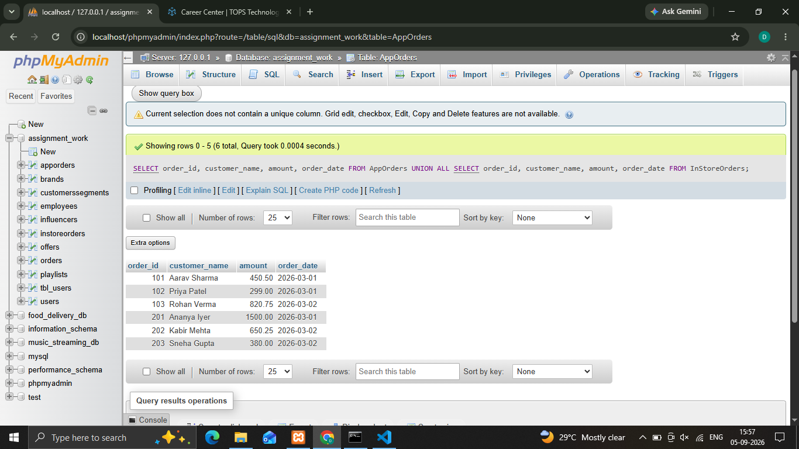
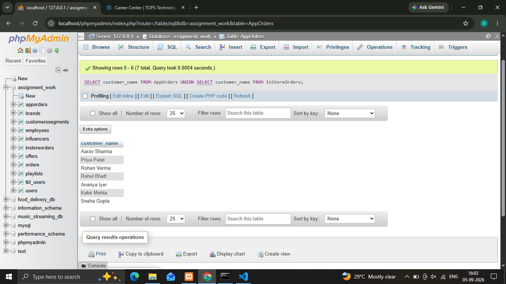
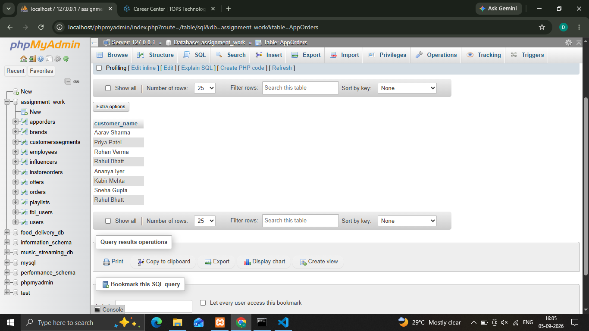

## 1.Create two tables: AppOrders (for orders placed via a food delivery app like Zomato) and InStoreOrders (for direct restaurant orders), each with columns: order_id, customer_name, amount, and order_date. Insert at least 3 sample records into each table.

**First Table :**
    
    

**Second Table :**

    

## 2.Write a SQL query using UNION to combine all unique customer names from both AppOrders and InStoreOrders tables into a single list.
'''
  **Syntax**

    ' SELECT customer_name FROM AppOrders UNION SELECT customer_name FROM InStoreOrders; '

'''
 

## 3.Write a SQL query using UNION ALL to display every order (including duplicates if any) from both AppOrders and InStoreOrders, showing order_id, customer_name, amount, and order_date.
'''
  **Syntax**

    ' SELECT order_id, customer_name, amount, order_date FROM AppOrders UNION ALL SELECT order_id, customer_name, amount, order_date FROM InStoreOrders; '

'''

## 4.Demonstrate the difference between UNION and UNION ALL by adding a duplicate customer_name in both tables, then running both queries and noting the difference in the result count.  <em><strong>Hint:</strong> UNION removes duplicates, UNION ALL does not.</em>

  **UNION Query**

  

  **UNION ALL QUERY**

  

'''
   Key Difference : UNION performs a distinct check to remove redundant entries (returning 7 rows), whereas UNION ALL combines all data directly without removing duplicates (returning 8 rows), making UNION ALL faster for large datasets when duplicates are acceptable.
'''   

