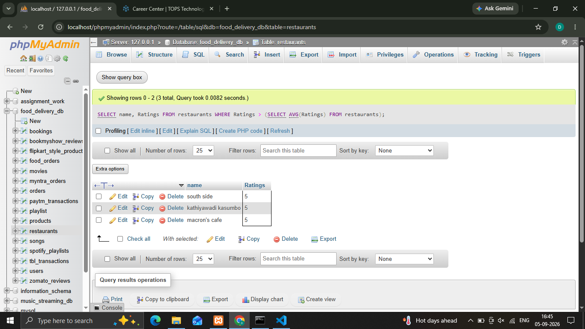
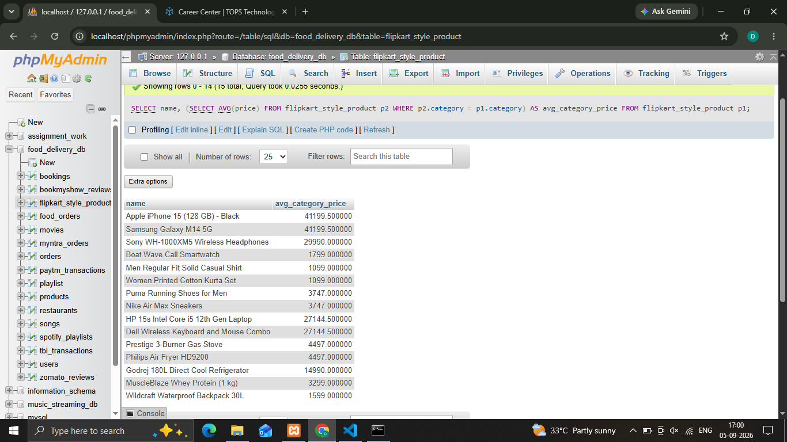
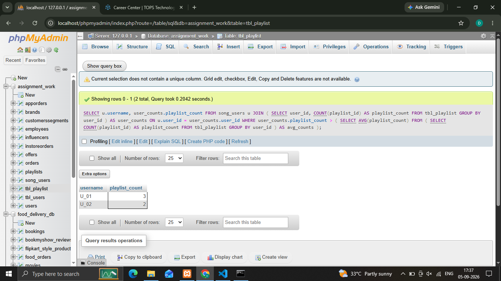
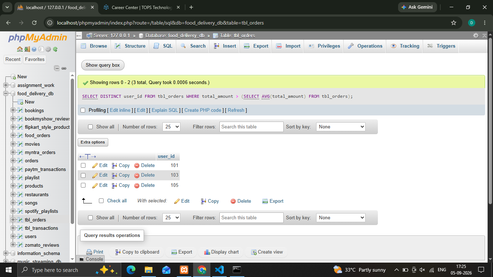

## 1.Write a SQL query to display the names and ratings of restaurants (from a table named Restaurants) where the rating is higher than the average rating of all restaurants in the table.  <em><strong>Hint:</strong> Use a subquery in the WHERE clause to calculate the average rating.</em>
'''
  **Syntax**
    
    ' SELECT name, Ratings FROM restaurants WHERE Ratings > (SELECT AVG(Ratings) FROM restaurants); '

'''
    

## 2.In a Flipkart-style Products table (columns: product_id, name, price, category), write a SQL query to list each product name along with the average price of its category as an additional column using a scalar subquery in the SELECT statement.
'''
  **Syntax**
    
    ' SELECT name, (SELECT AVG(price) FROM flipkart_style_product p2 WHERE p2.category = p1.category) AS avg_category_price FROM flipkart_style_product p1; '

'''

## 3.Given a Playlists table (playlist_id, user_id, playlist_name) and a Users table (user_id, username), write a SQL query using a subquery in the FROM clause to show each username and the number of playlists they have created, displaying only users who have created more playlists than the average number of playlists per user.  <em><strong>Hint:</strong> Use a derived table (subquery in FROM) to count playlists per user, then filter with a subquery in WHERE.</em>
'''
  **Syntax**
    
    ' SELECT u.username, user_counts.playlist_count FROM song_users u JOIN ( SELECT user_id, COUNT(playlist_id) AS playlist_count FROM tbl_playlist GROUP BY user_id ) AS user_counts ON u.user_id = user_counts.user_id WHERE user_counts.playlist_count > ( SELECT AVG(playlist_count) FROM ( SELECT COUNT(playlist_id) AS playlist_count FROM tbl_playlist GROUP BY user_id ) AS avg_counts ); '

'''

## 4.Suppose you have an Orders table (order_id, user_id, total_amount) for a food delivery app. Write a query to find all user_ids who have placed at least one order with a total_amount greater than the average order amount, using a subquery in the WHERE clause
'''
  **Syntax**
    
    ' SELECT DISTINCT user_id FROM tbl_orders WHERE total_amount > (SELECT AVG(total_amount) FROM tbl_orders); '

'''

