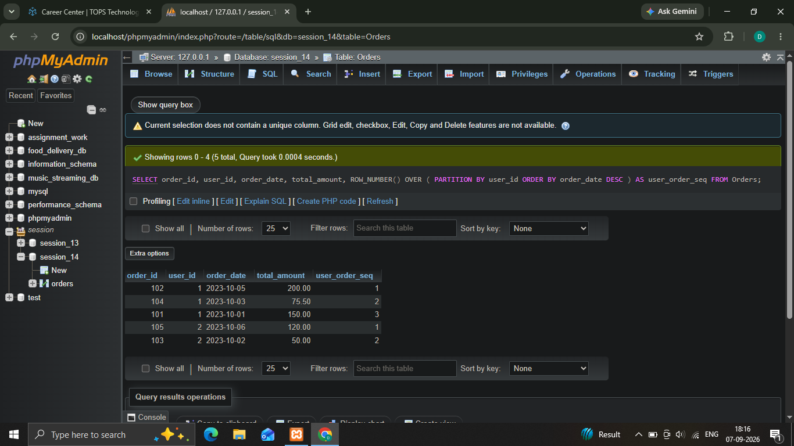
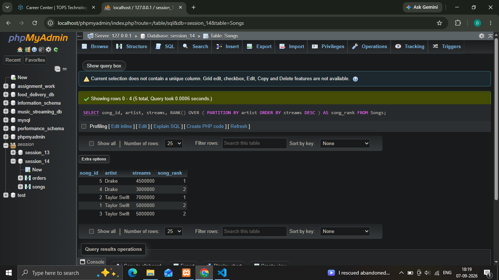
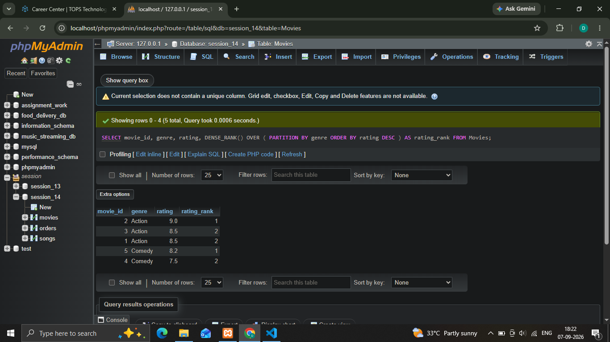
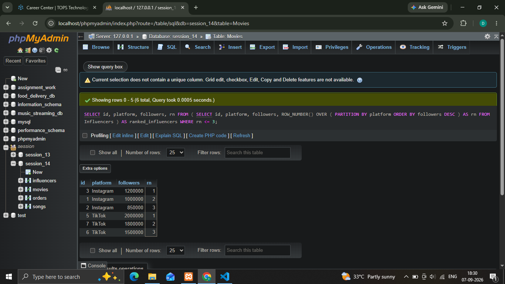

## 1.Given a table Orders with columns (order_id, user_id, order_date, total_amount), write an SQL query using ROW_NUMBER() to assign a unique sequential number to each order per user, ordered by order_date descending.
'''
  **Syntax**

    ' SELECT order_id, user_id, order_date, total_amount, ROW_NUMBER() OVER ( PARTITION BY user_id ORDER BY order_date DESC ) AS user_order_seq FROM Orders; '

'''

## 2.Suppose you have a table called Songs with columns (song_id, artist, streams). Write an SQL query using RANK() to list each song along with its rank based on streams within each artist.
'''
  **Syntax**

    ' SELECT song_id, artist, streams, RANK() OVER ( PARTITION BY artist ORDER BY streams DESC ) AS song_rank FROM Songs;
 '

'''    

## 3.For a table named Movies with columns (movie_id, genre, rating), write an SQL query using DENSE_RANK() to assign a rank to each movie within its genre based on rating, with the highest rating getting rank 1.
'''
  **Syntax**

    ' SELECT movie_id, genre, rating, DENSE_RANK() OVER ( PARTITION BY genre ORDER BY rating DESC ) AS rating_rank FROM Movies; '

'''    

## 4.Imagine a table named Influencers with columns (id, platform, followers). Write an SQL query to display the top 3 influencers per platform using ROW_NUMBER(), showing id, platform, followers, and their row number.  <em><strong>Hint:</strong> Use a subquery or CTE to filter for row numbers less than or equal to 3.</em>
'''
  **Syntax**

    ' SELECT id, platform, followers, rn FROM ( SELECT id, platform, followers, ROW_NUMBER() OVER ( PARTITION BY platform ORDER BY followers DESC ) AS rn FROM Influencers ) AS ranked_influencers WHERE rn <= 3; '

''' 
   