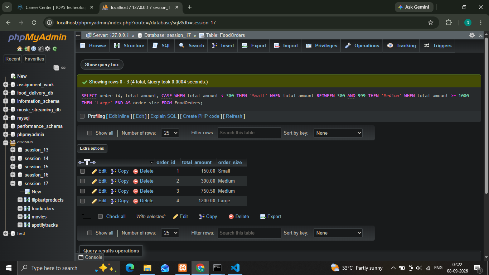
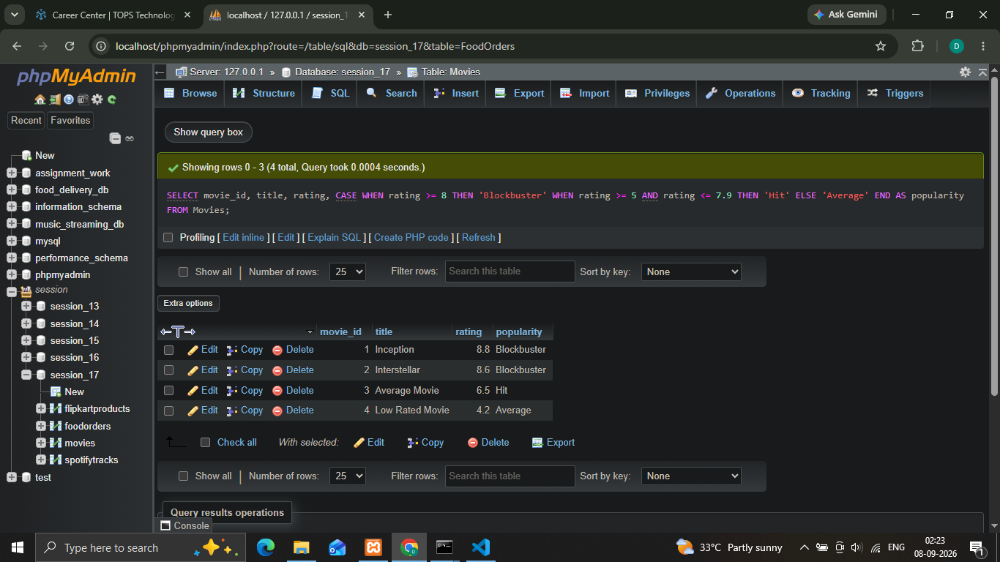
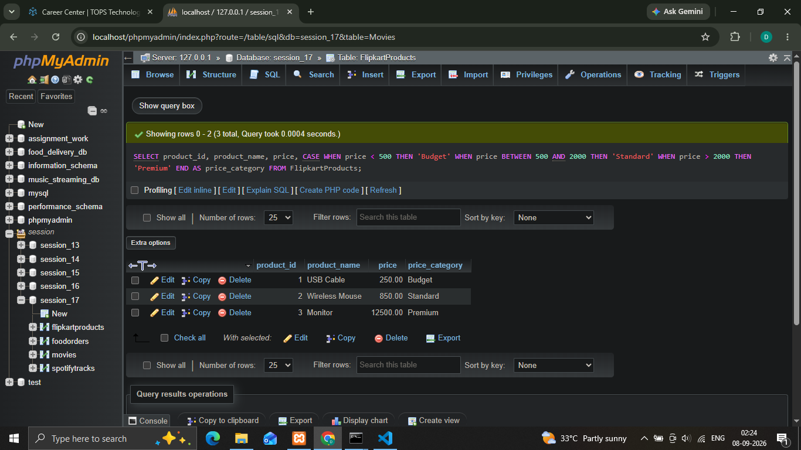
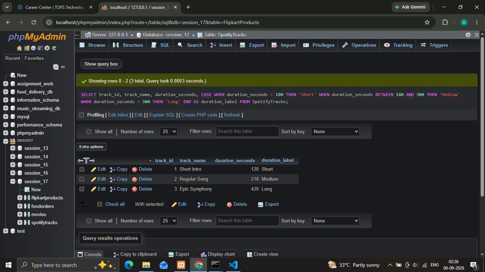

## 1.Write an SQL query using CASE WHEN to classify orders in a 'FoodOrders' table as 'Small', 'Medium', or 'Large' based on the total_amount: 'Small' for less than 300, 'Medium' for 300 to 999, and 'Large' for 1000 and above.
'''
  **Syntax**
    
    ' SELECT order_id, total_amount, CASE WHEN total_amount < 300 THEN 'Small' WHEN total_amount BETWEEN 300 AND 999 THEN 'Medium' WHEN total_amount >= 1000 THEN 'Large' END AS order_size FROM FoodOrders; '

'''

## 2.Given a 'Movies' table with a 'rating' column (out of 10), write an SQL query that adds a new column 'popularity' which shows 'Blockbuster' for ratings 8 and above, 'Hit' for 5 to 7.9, and 'Average' for below 5 using CASE WHEN ELSE END.
'''
  **Syntax**
    
    ' SELECT movie_id, title, rating, CASE WHEN rating >= 8 THEN 'Blockbuster' WHEN rating >= 5 AND rating <= 7.9 THEN 'Hit' ELSE 'Average' END AS popularity FROM Movies; '

'''

## 3.For a 'FlipkartProducts' table with a 'price' column, write an SQL query to create a 'price_category' column that bins prices as 'Budget' (below 500), 'Standard' (500 to 2000), and 'Premium' (above 2000) using CASE WHEN.
'''
  **Syntax**
    
    ' SELECT product_id, product_name, price, CASE WHEN price < 500 THEN 'Budget' WHEN price BETWEEN 500 AND 2000 THEN 'Standard' WHEN price > 2000 THEN 'Premium' END AS price_category FROM FlipkartProducts; '

'''

## 4.Write an SQL query for a 'SpotifyTracks' table that uses CASE WHEN to assign a 'duration_label' column: 'Short' for tracks under 180 seconds, 'Medium' for 180-300 seconds, and 'Long' for over 300 seconds.  <em><strong>Hint:</strong> Use multiple WHEN conditions to cover all possible durations.</em>
'''
  **Syntax**
    
    ' SELECT track_id, track_name, duration_seconds, CASE WHEN duration_seconds < 180 THEN 'Short' WHEN duration_seconds BETWEEN 180 AND 300 THEN 'Medium' WHEN duration_seconds > 300 THEN 'Long' END AS duration_label FROM SpotifyTracks; '

'''
