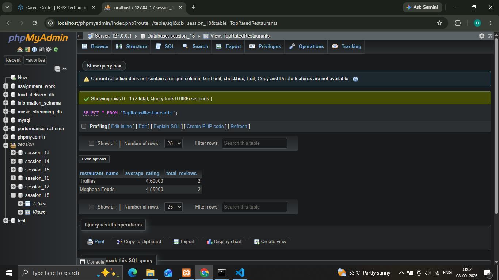
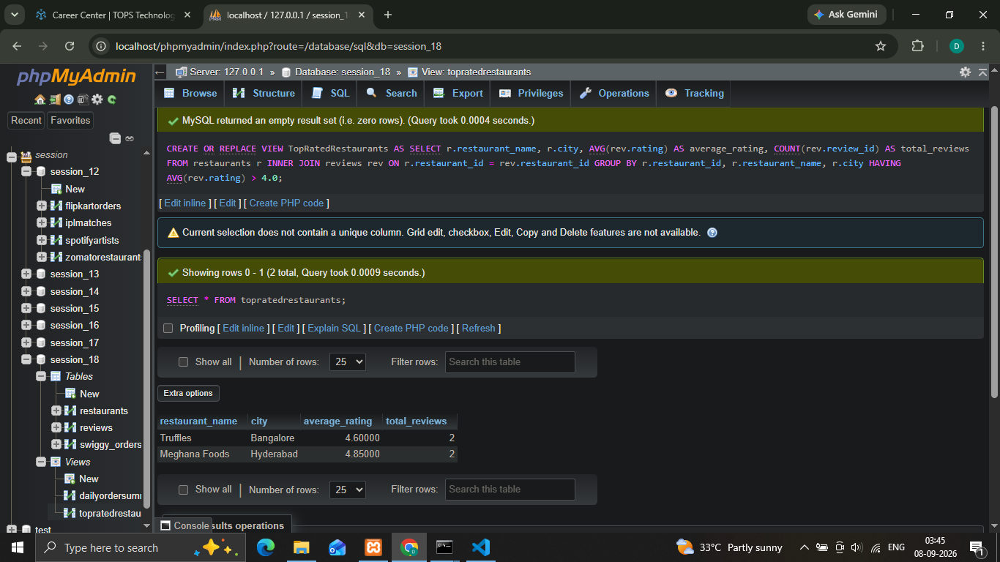
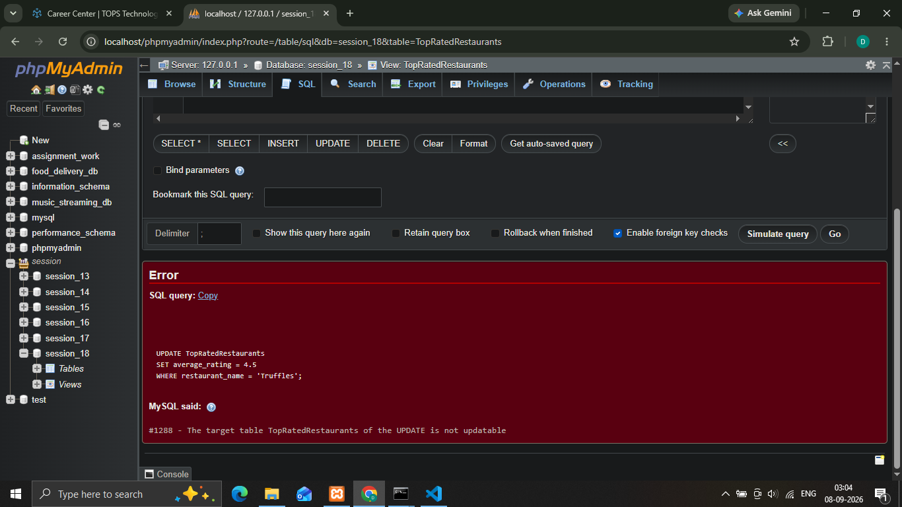
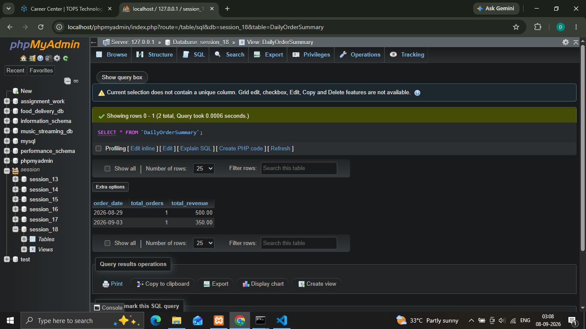

## 1.Create a SQL view named TopRatedRestaurants that selects the restaurant name, average rating, and total number of reviews from a table of Zomato-style restaurant reviews, showing only restaurants with an average rating above 4.0.
'''
  **Syntax**
    
    ' CREATE OR REPLACE VIEW TopRatedRestaurants AS SELECT r.restaurant_name, AVG(rev.rating) AS average_rating, COUNT(rev.review_id) AS total_reviews FROM restaurants r INNER JOIN reviews rev ON r.restaurant_id = rev.restaurant_id GROUP BY r.restaurant_id, r.restaurant_name HAVING AVG(rev.rating) > 4.0; '

'''

## 2.Update the TopRatedRestaurants view to also include the city column from the original restaurants table by joining the relevant tables.  <em><strong>Hint:</strong> Use an INNER JOIN to combine data from both tables in your view definition.</em>
'''
  **Syntax**
    
    ' CREATE OR REPLACE VIEW TopRatedRestaurants AS SELECT r.restaurant_name, r.city, AVG(rev.rating) AS average_rating, COUNT(rev.review_id) AS total_reviews FROM restaurants r INNER JOIN reviews rev ON r.restaurant_id = rev.restaurant_id GROUP BY r.restaurant_id, r.restaurant_name, r.city HAVING AVG(rev.rating) > 4.0; '

'''

## 3.Try to update the average rating column directly through the TopRatedRestaurants view and observe what error or limitation occurs. Write down the exact error message and explain why this happens based on SQL view limitations.
'''
  # Exact Error :
    ' ERROR 1351 (HY000): View's SELECT contains aggregates, GROUP BY, or HAVING '

  # Why This Happen :  
    ' Views derived from aggregate functions (AVG(), COUNT()), GROUP BY, or multi-table joins do not have a direct 1-to-1 relationship with individual rows in the base tables. MySQL cannot determine how to update underlying row values in reviews to achieve a requested aggregate value. '

'''

## 4.Create a view called DailyOrderSummary that shows, for each date, the total number of food orders and the total revenue from a Swiggy-style orders table. Ensure the view only includes dates from the last 30 days.  <em><strong>Constraint:</strong> Use WHERE and GROUP BY clauses in your view definition.</em>
'''
  **Syntax**
    
    ' CREATE OR REPLACE VIEW DailyOrderSummary AS SELECT order_date, COUNT(order_id) AS total_orders, SUM(order_amount) AS total_revenue FROM swiggy_orders WHERE order_date >= CURRENT_DATE - INTERVAL 30 DAY GROUP BY order_date; '

'''

## 5.List 3 good practices you should follow when creating SQL views for analytics dashboards, and for each, give a one-line example related to a Flipkart sales reporting scenario.
'''
  # Standardize Naming Conventions with Prefixes: 
    ' Prefix views clearly (e.g., vw_) to help reporting tools like Power BI distinguish virtual aggregated views from physical base tables. '

   # -Example: 
    ' Name a Flipkart daily performance view vw_flipkart_daily_sales instead of naming it flipkart_sales.'

  # Explicitly Define Columns (Avoid SELECT *): 
    ' Specify every required column explicitly to prevent downstream dashboard schema errors if underlying base tables are updated. '

   # -Example:
    ' Define SELECT order_id, product_category, seller_id, gross_revenue instead of using SELECT * on the base orders table.'

  # Pre-Aggregate Data inside the SQL Engine:
    ' Perform joins and heavy computations within the view rather than letting dashboard tools recalculate row-level metrics.'

   # -Example:
    ' Pre-calculate SUM(item_price * quantity) AS total_sales grouped by seller_id directly in the SQL view to reduce dashboard load times.'  
    

'''

