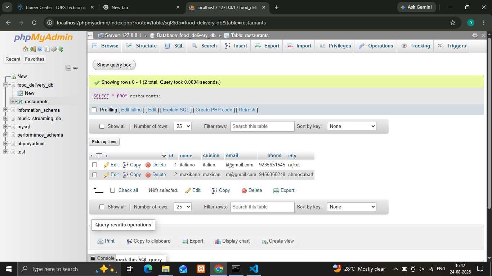
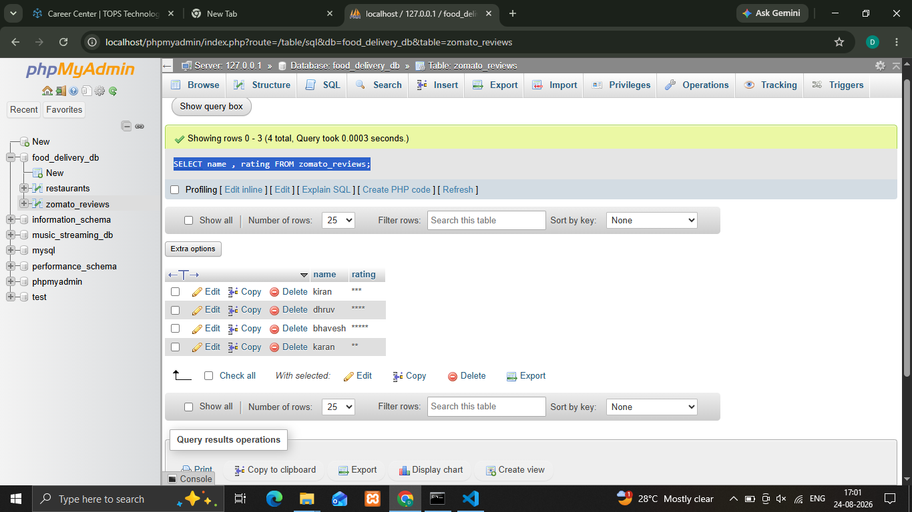
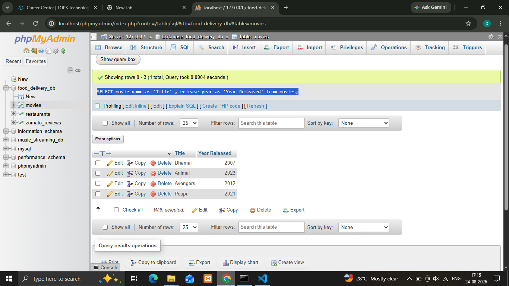
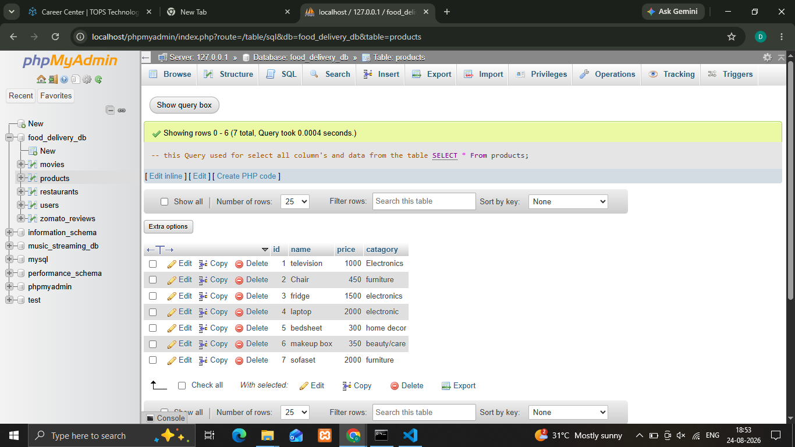

## 1.Open your SQL editor and run a query to select all columns from a table named restaurants using SELECT * FROM restaurants;.

'''
 **Synatax**
    
    ' SELECT * FROM restaurants; '
'''    
text

## 2.Write an SQL query to display only the name and rating columns from the table zomato_reviews

'''
 **Synatax**
    
    ' SELECT name , rating FROM zomato_reviews; '
''' 

## 3.Write an SQL query to select the movie_name and release_year columns from a table called movies, but rename movie_name as 'Title' and release_year as 'Year Released' in the output using the AS keyword.

'''
 **Synatax**
    
    ' SELECT movie_name as 'Title' , release_year as 'Year Released' from movies; '
''' 

## 4.In a table called products, write an SQL query that selects all columns and add a comment in your SQL code explaining what the query does.

'''
 **Synatax**
    
    ' -- this Query used for select all column's and data from the table
       
      SELECT * From products; '
''' 

