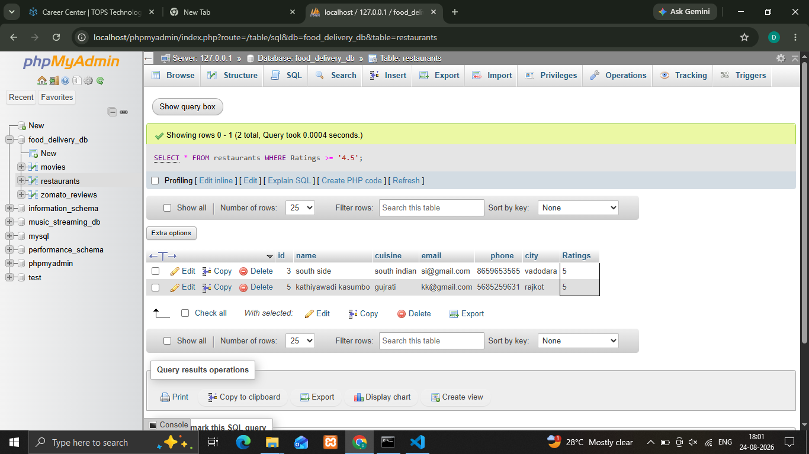
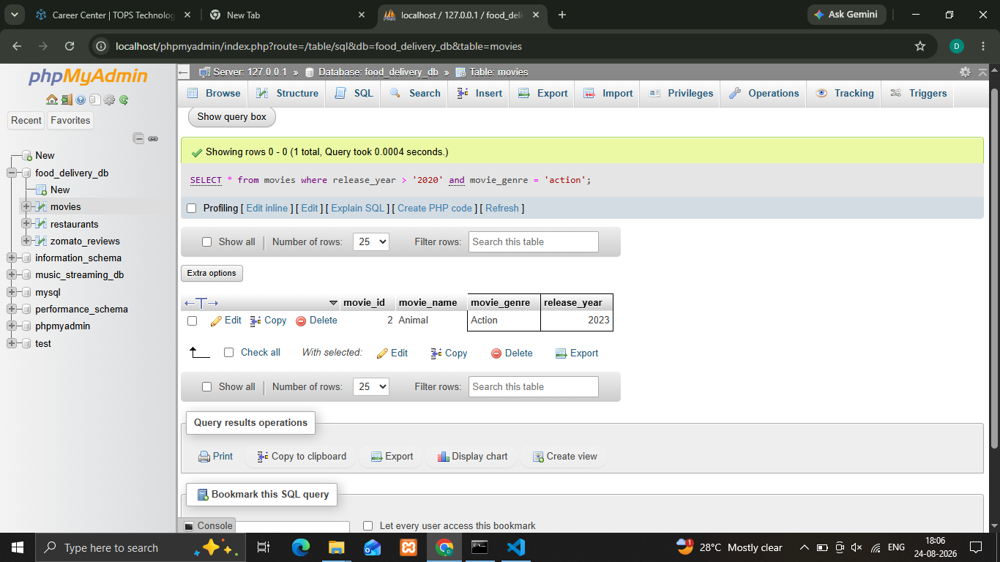
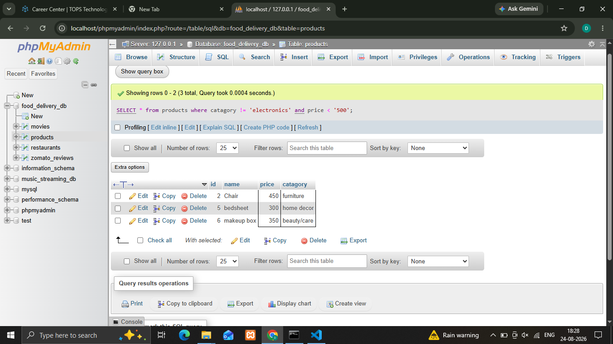
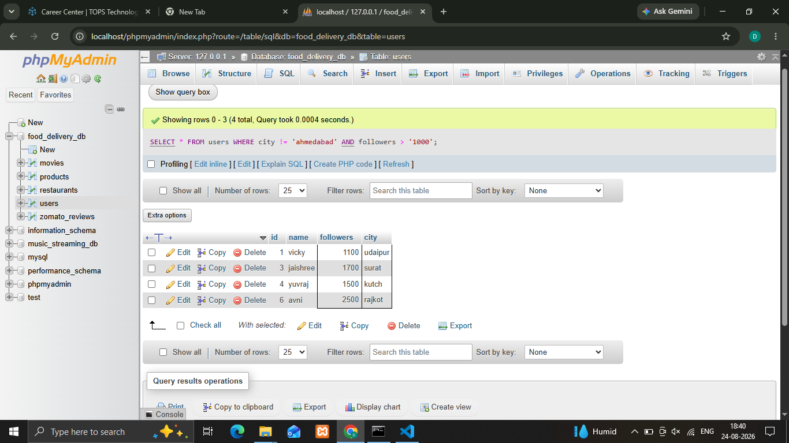

## 1.Write an SQL query to select all restaurants from a table named 'restaurants' where the rating is greater than or equal to 4.5 .
...
 **Syntax**
    
    ' SELECT * FROM restaurants WHERE Ratings >= '4.5'; '

'''

## 2.In a table called 'movies', filter and display only the movies released after 2020 and with genre 'Action' using the WHERE clause and AND operator.
...
 **Syntax**
    
    ' SELECT * from movies where release_year > '2020' and movie_genre = 'action' '

'''

## 3.Given a table 'products' with columns (id, name, price, category), write a query to find all products not in the 'Electronics' category or with a price less than 500.
...
 **Syntax**
    
    ' SELECT * from products where catagory != 'electronics' and price < '500'; '

'''

## 4.Write an SQL query for a table 'users' to show all users who are NOT from 'Ahmedabad' and have more than 1000 followers.
...
 **Syntax**
    
    ' SELECT * FROM users WHERE city != 'ahmedabad' AND followers > '1000'; '

'''
