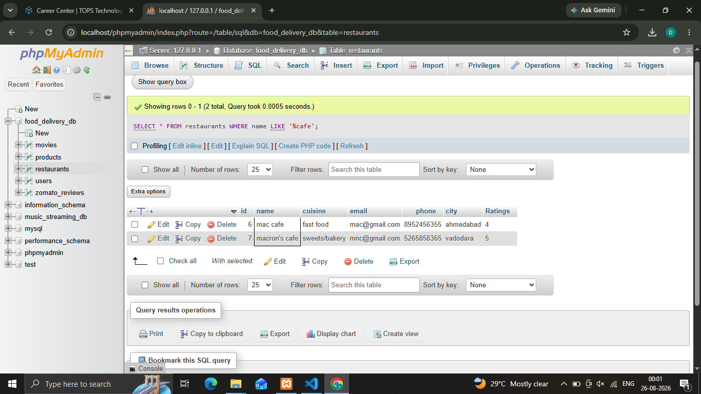
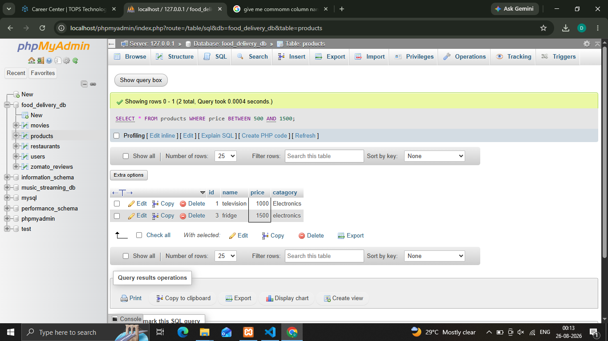
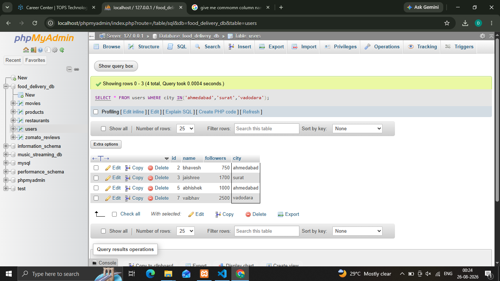

## 1.Write an SQL query to find all restaurants in a table called     Restaurants whose names end with 'Cafe' using the LIKE operator.
'''
 **Syntax**

   ' SELECT * FROM restaurants WHERE name LIKE '%cafe'; '
'''

## 2.In a Flipkart-style Products table, use the BETWEEN operator to select all products with a price between 500 and 1500 rupees.
'''
 **Syntax**

   ' SELECT * FROM products WHERE price BETWEEN 500 AND 1500; '
'''

## 3.Write an SQL query to display all users from a Users table whose city is either 'Ahmedabad', 'Surat', or 'Vadodara' using the IN operator.
'''
 **Syntax**

   ' SELECT * FROM users WHERE city IN('ahmedabad','surat','vadodara'); '
'''

## 4.Given a table called Songs with columns song_name and artist_name, find all songs where the artist_name contains the letter sequence 'ar' anywhere in the name using the LIKE operator.
'''
 **Syntax**

   ' SELECT * FROM songs WHERE artist_name LIKE '%ar%' '
'''
