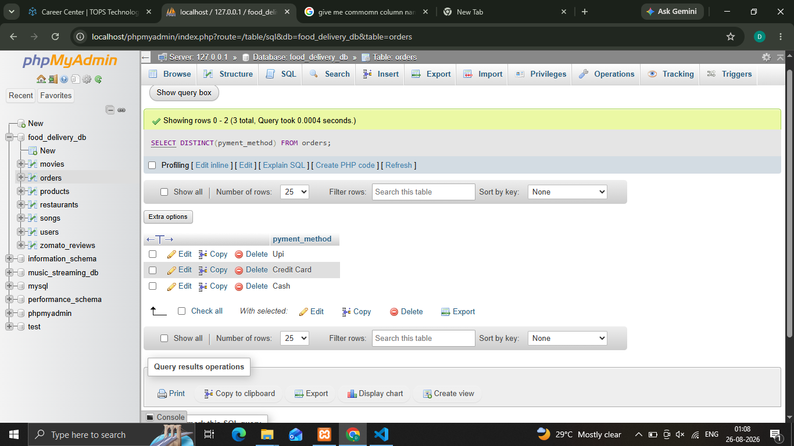
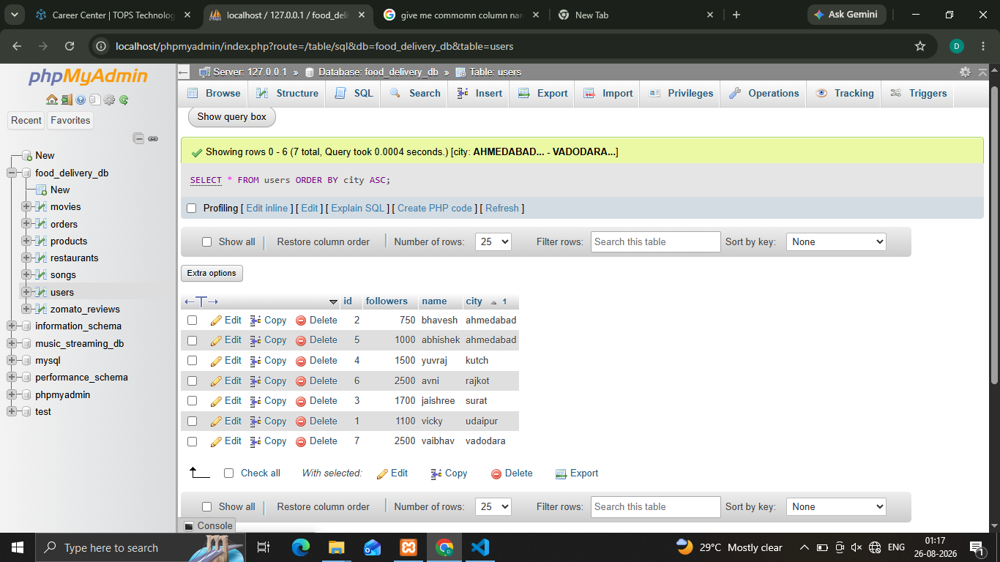
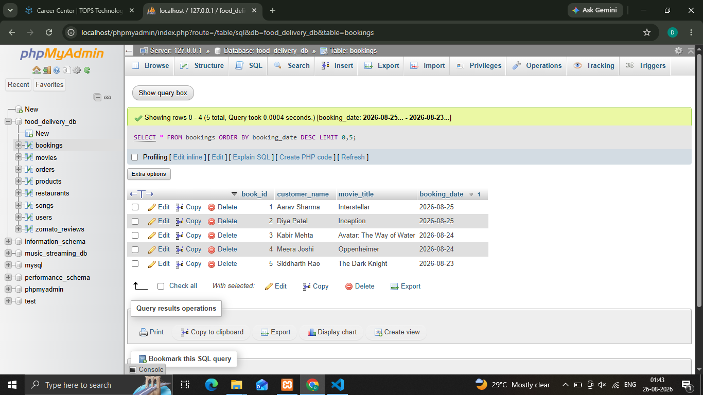
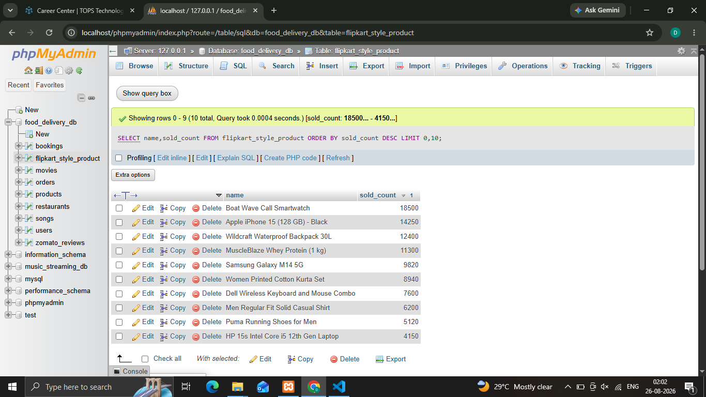

## 1.Write an SQL query using the DISTINCT keyword to find all unique payment methods used in the orders table of a food delivery app database.
'''
  **Syntax**
    
    ' SELECT DISTINCT(pyment_method) FROM orders; ' 
'''

## 2.Query the users table to list all cities where users have registered, but display each city only once and sort the result in alphabetical order (A-Z).
'''
  **Syntax**
    
    ' SELECT * FROM users ORDER BY city ASC; ' 
'''

## 3.Write an SQL query to select the top 5 most recent movie bookings from the bookings table, ordered by booking_date in descending order.
'''
  **Syntax**
    
    ' SELECT * FROM bookings ORDER BY booking_date DESC LIMIT 0,5; ' 
'''

## 4.From a products table containing Flipkart-style product data (id, name, category, sold_count), write an SQL query to retrieve the 10 products with the highest sold_count, displaying only product name and sold_count, sorted from highest to lowest.
'''
  **Syntax**
    
    ' SELECT name,sold_count FROM flipkart_style_product ORDER BY sold_count DESC LIMIT 0,10; ' 
'''
