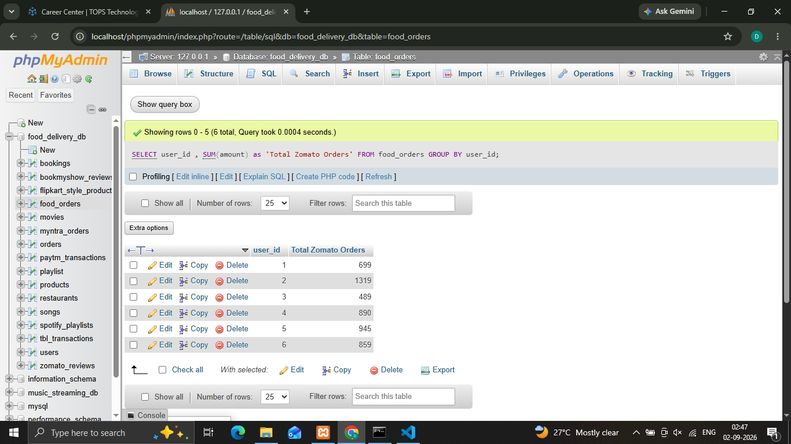
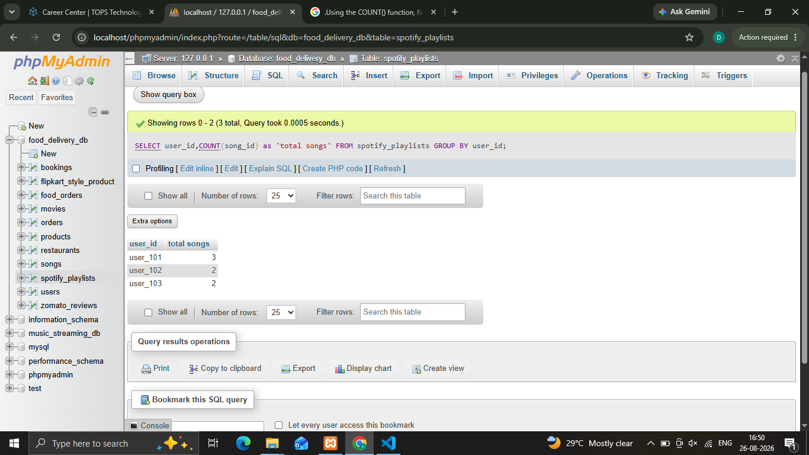
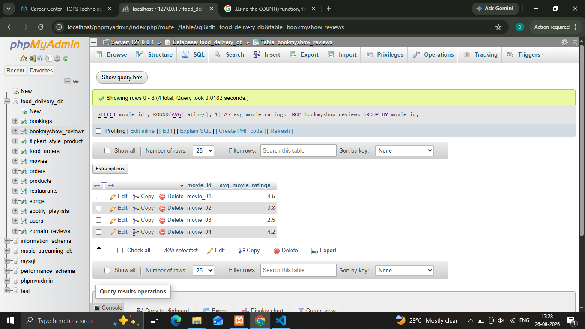
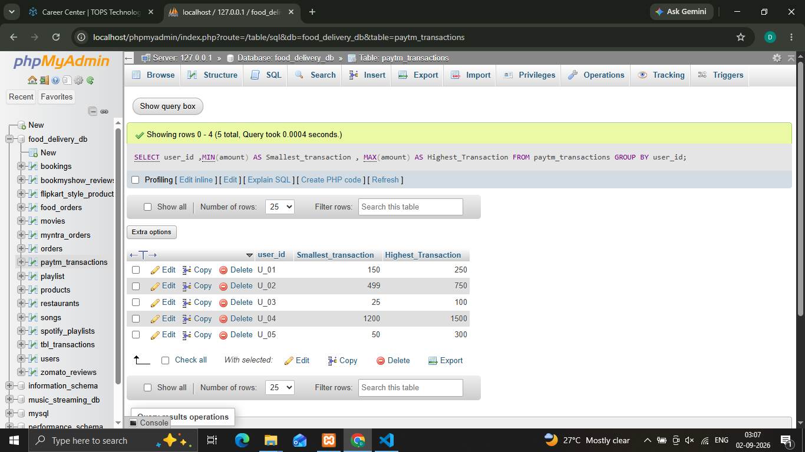
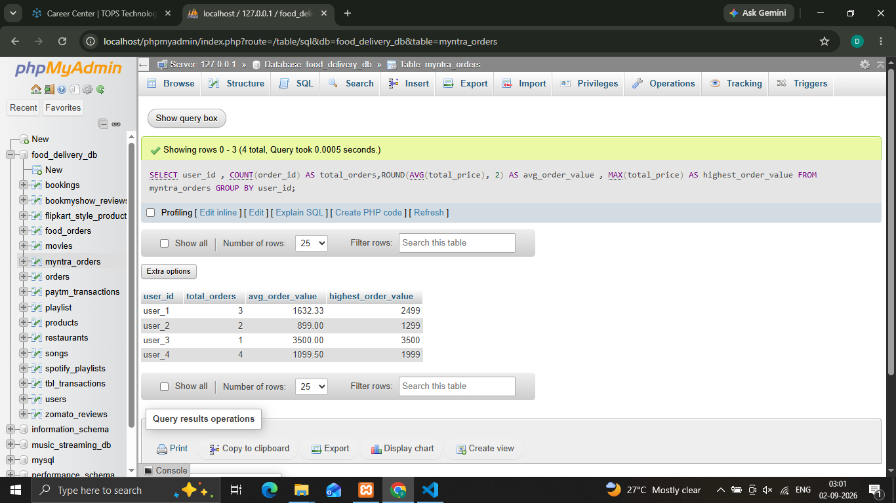

## 1.Write an SQL query using the SUM() function to calculate the total amount spent by users on food orders in a table food_orders (columns: order_id, user_id, amount) — imagine it's like Zomato's order history.
'''
  **Synatax**
    
    ' SELECT user_id , SUM(amount) as 'Total Zomato Orders' FROM food_orders GROUP BY user_id; '
'''

## 2.Using the COUNT() function, find out how many songs a user has added to their playlist in a table spotify_playlists (columns: playlist_id, user_id, song_id).
'''
  **Synatax**
    
    ' SELECT user_id,COUNT(song_id) as 'total songs' FROM spotify_playlists GROUP BY user_id; '
'''

## 3.Write an SQL query to get the average rating given to a movie in a table bookmyshow_reviews (columns: review_id, movie_id, rating), and round the result to 1 decimal place using the ROUND() function
'''
  **Synatax**
    
    ' SELECT movie_id , ROUND(AVG(ratings), 1) AS avg_movie_ratings FROM bookmyshow_reviews GROUP BY    movie_id; '
'''

## 4.Find the minimum and maximum transaction values for a user from a table paytm_transactions (columns: txn_id, user_id, amount) — show both the smallest and largest transaction amounts.
'''
  **Synatax**
    
    ' SELECT user_id , MIN(amount) AS Smallest_transaction , MAX(amount) AS Highest_Transaction FROM paytm_transactions GROUP BY user_id '
'''

## 5.Given a table myntra_orders (columns: order_id, user_id, total_price), write an SQL query to display the total number of orders, the average order value (rounded to 2 decimals), and the highest order value for each user_id.  <em><strong>Constraint:</strong> Use GROUP BY to get results per user.</em>
'''
  **Synatax**
    
    ' SELECT user_id , COUNT(order_id) AS total_orders,ROUND(AVG(total_price), 2) AS avg_order_value , MAX(total_price) AS highest_order_value FROM myntra_orders GROUP BY user_id '
'''
