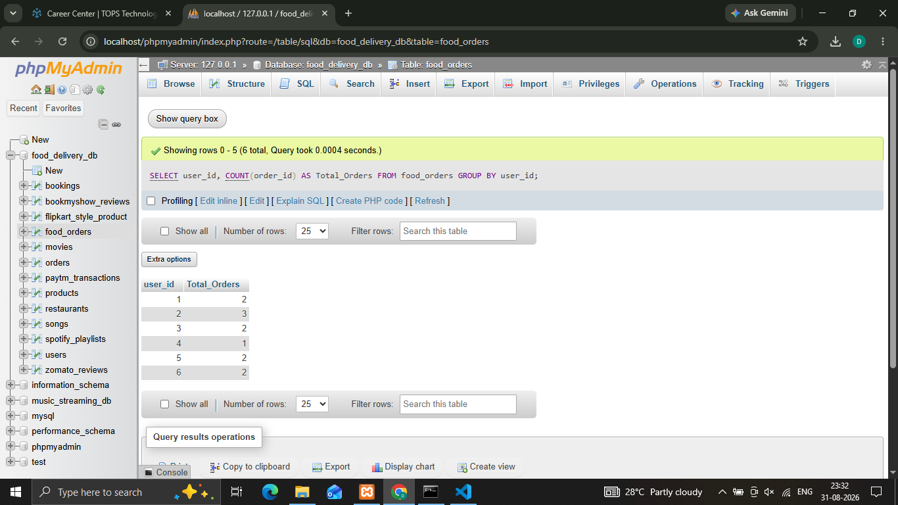
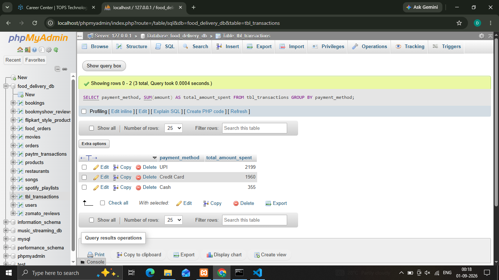
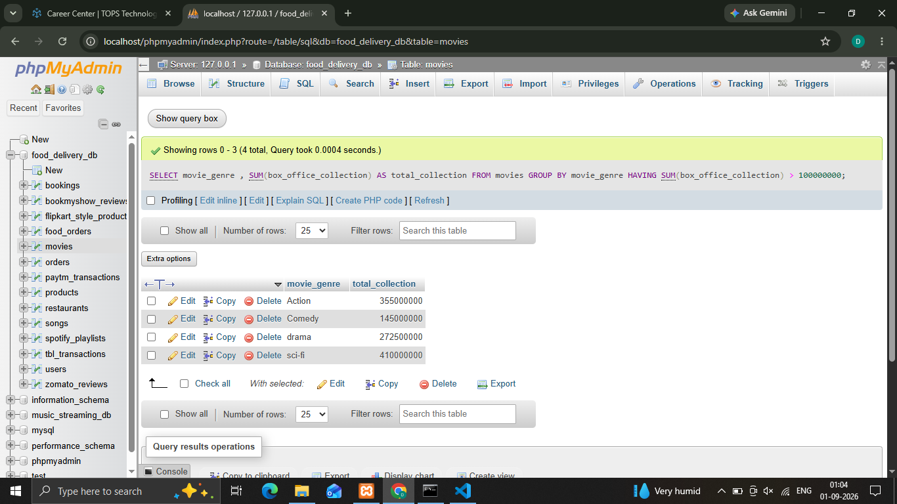
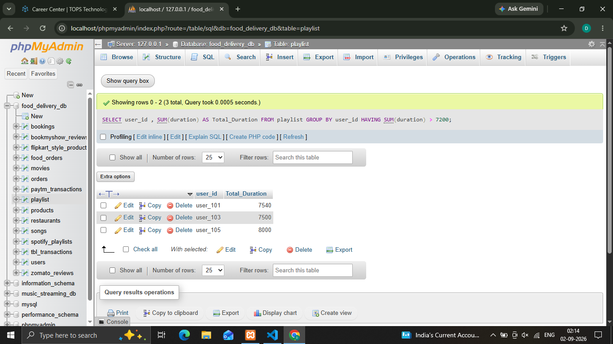

## 1.Write an SQL query to display the total number of orders placed by each user in a 'food_orders' table, grouped by user_id.
'''
  **Syntax**

   ' SELECT user_id, COUNT(order_id) AS Total_Orders FROM food_orders GROUP BY user_id; '
'''

## 2.Using a 'transactions' table with columns (transaction_id, user_id, amount, payment_method), write an SQL query to show the total amount spent by each payment_method.
'''
  **Syntax**

   ' SELECT payment_method, SUM(amount) AS total_amount_spent FROM tbl_transactions GROUP BY payment_method; '
'''

## 3.Given a 'movies' table with columns (movie_id, genre, box_office_collection), write an SQL query to display each genre and its total box_office_collection, but only show genres where the total collection is above 10 crore.
'''
  **Syntax**

   ' SELECT movie_genre , SUM(box_office_collection) AS total_collection FROM movies GROUP BY         movie_genre HAVING SUM(box_office_collection) > 100000000; '
'''

## 4.Suppose you have a 'playlist' table with columns (playlist_id, user_id, song_id, duration). Write an SQL query to find users who have created playlists with a combined song duration of more than 2 hours (7200 seconds), showing user_id and total duration.
'''
  **Syntax**

   ' SELECT user_id , SUM(duration) AS Total_Duration FROM playlist GROUP BY user_id HAVING SUM(duration) > 7200; '
'''
