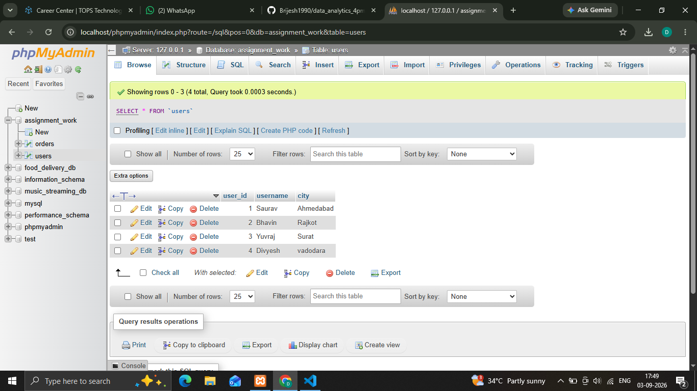
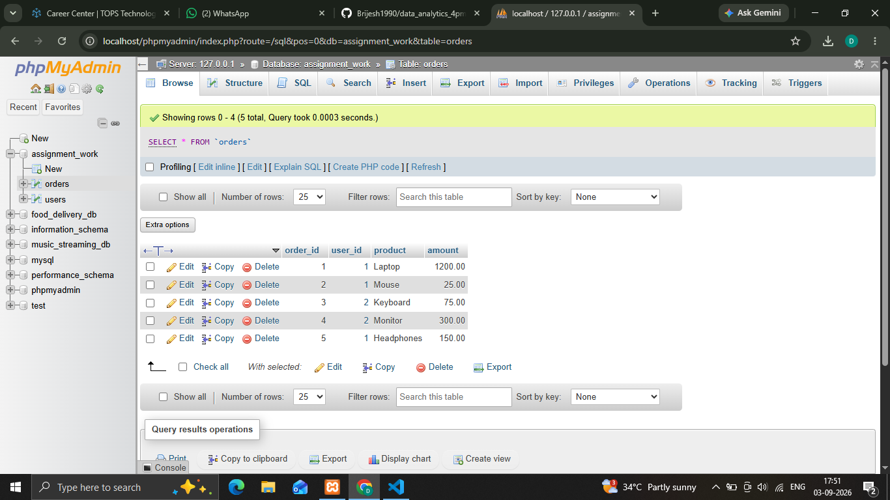
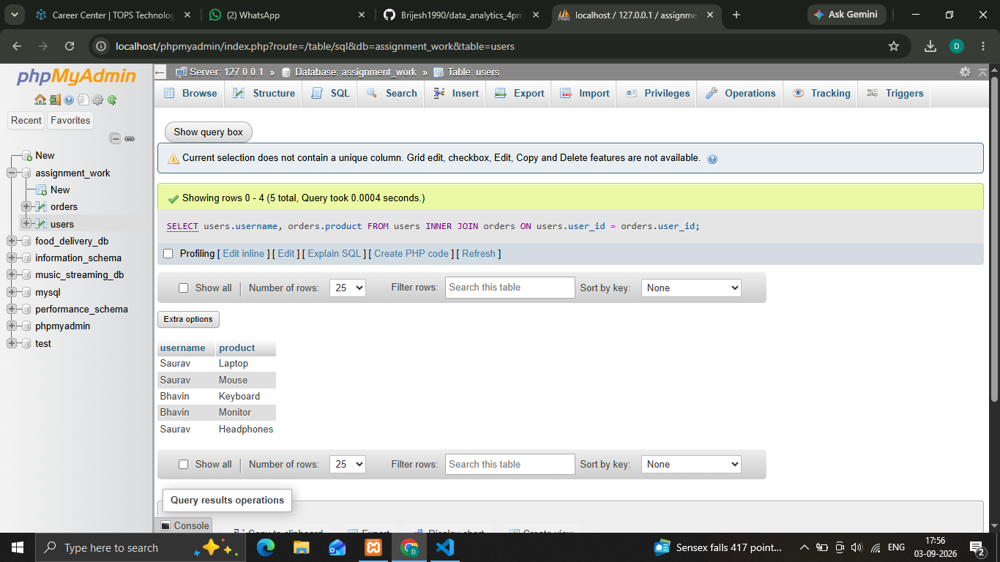
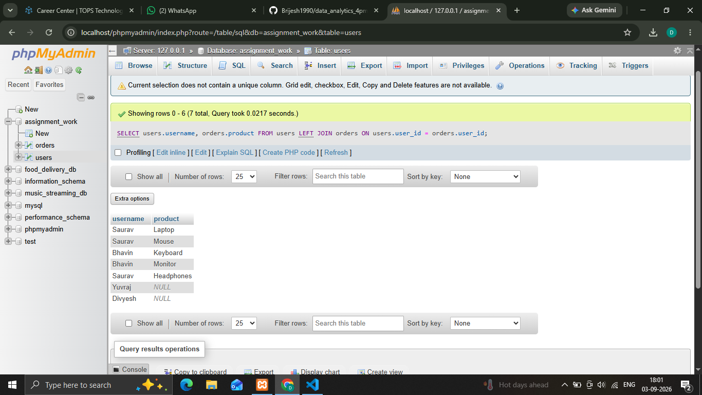
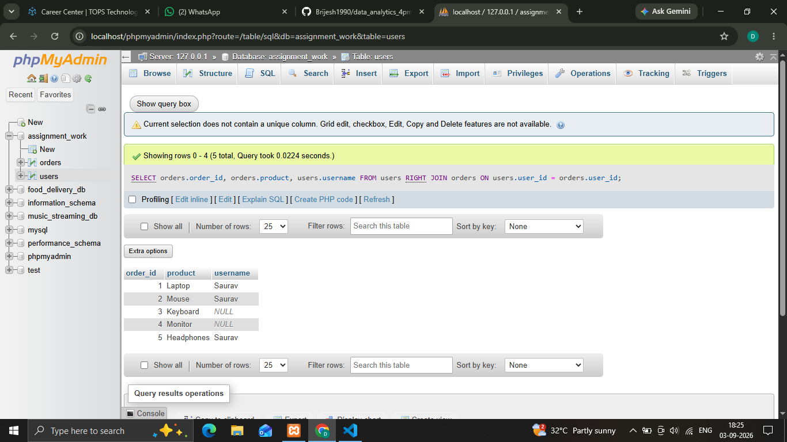
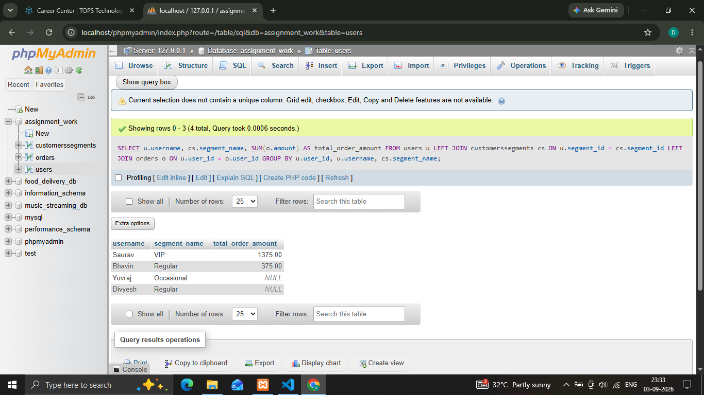

## 1.Create two tables in your SQL database: Users (user_id, username, city) and Orders (order_id, user_id, product, amount). Insert at least 3 users and 5 orders, making sure some users have no orders.

**User Table**

  

**Order table**

  

## 2.Write an SQL query using INNER JOIN to list all usernames and their ordered products, showing only users who have placed at least one order.
'''
  **Syntax**
   
   ' SELECT users.username, orders.product FROM users INNER JOIN orders ON users.user_id = orders.user_id; '

'''

## 3.Write an SQL query using LEFT JOIN to display all usernames along with their ordered products. For users who haven't placed any orders, show NULL for the product.
'''
  **Syntax**
   
   ' SELECT users.username, orders.product FROM users LEFT JOIN orders ON users.user_id = orders.user_id; '

'''

## 4.Write an SQL query using RIGHT JOIN to show all orders and the corresponding username for each order. If an order has a user_id that doesn't exist in the Users table, display NULL for the username.  <em><strong>Hint:</strong> Try deleting one user and keeping their order to test this case.</em>
'''
  **Syntax**
   
   ' SELECT orders.order_id, orders.product, users.username FROM users RIGHT JOIN orders ON users.user_id = orders.user_id; '

'''

## 5.Suppose you want to analyze food delivery data like Zomato. Create a CustomerSegments table (segment_id, segment_name), and link it to Users with a foreign key. Write an SQL query to show each username, their segment name, and total order amount (use JOINs as needed).
'''
  **Syntax**
   
   ' SELECT u.username, cs.segment_name, SUM(o.amount) AS total_order_amount FROM users u LEFT JOIN customerssegments cs ON u.segment_id = cs.segment_id LEFT JOIN orders o ON u.user_id = o.user_id GROUP BY u.user_id, u.username, cs.segment_name; '

'''
