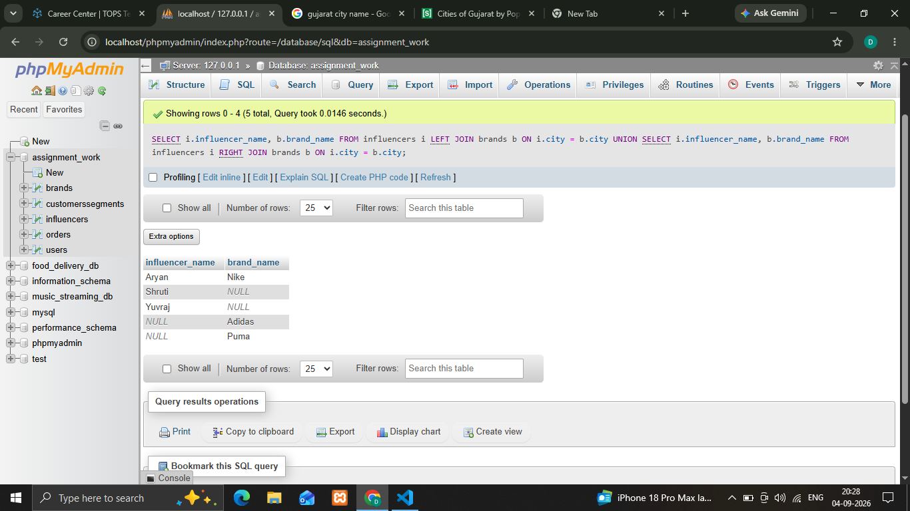
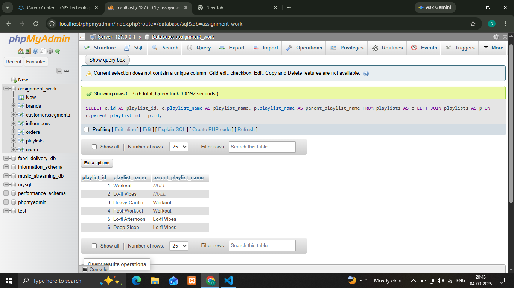
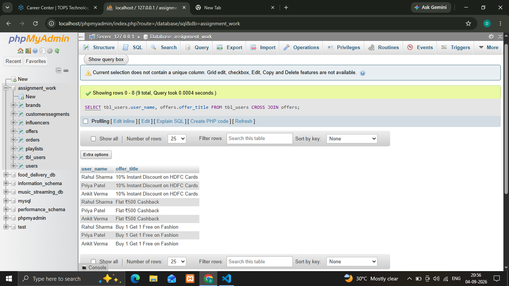
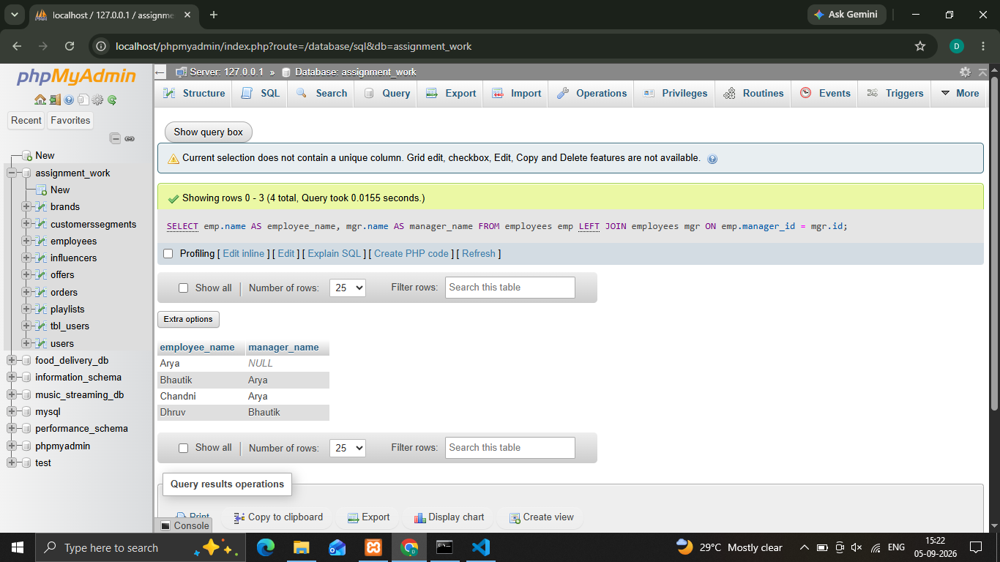
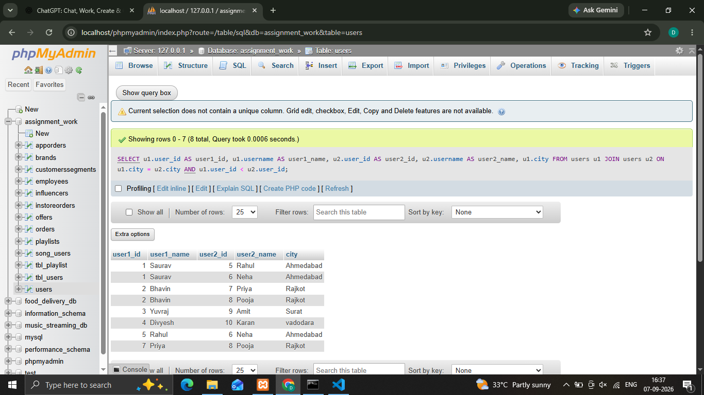

## 1.Create two tables, influencers and brands, with at least 3 sample rows each. Use a FULL OUTER JOIN to list all influencers and brands, showing influencer_name and brand_name, matching on city. If there is no match, display NULL for the missing side.  <em><strong>Hint:</strong> Use LEFT JOIN, RIGHT JOIN, and UNION if your SQL dialect does not support FULL OUTER JOIN directly.</em>
'''
  **Syntax**

    ' SELECT i.influencer_name, b.brand_name FROM influencers i LEFT JOIN brands b ON i.city = b.city UNION SELECT i.influencer_name, b.brand_name FROM influencers i RIGHT JOIN brands b ON i.city = b.city; '

'''

## 2.Given a table called playlists with columns (id, playlist_name, parent_playlist_id), write a SELF JOIN query to display each playlist alongside its parent playlist's name, similar to how Spotify might nest playlists.
'''
  **Syntax**

    ' SELECT c.id AS playlist_id, c.playlist_name AS playlist_name, p.playlist_name AS parent_playlist_name FROM playlists AS c LEFT JOIN playlists AS p ON c.parent_playlist_id = p.id '

'''

## 3.Create two tables: users and offers. Write a CROSS JOIN query to generate all possible combinations of users and offers, displaying user_name and offer_title. Explain in a comment how this could be used for a Flipkart-style personalized offer campaign.
'''
  **Syntax**

    ' SELECT tbl_users.user_name, offers.offer_title FROM tbl_users CROSS JOIN offers; '

'''

## 4.You have an employees table with columns (id, name, manager_id). Write a SELF JOIN to display each employee's name along with their manager's name. Then, modify your query to only show employees who do not have a manager (i.e., top-level managers).
'''
  **Syntax**

    ' SELECT emp.name AS employee_name, mgr.name AS manager_name FROM employees emp LEFT JOIN employees mgr ON emp.manager_id = mgr.id; '

'''

## 5.Use ChatGPT or Copilot to help you write a SQL query that finds all pairs of users from a users table who live in the same city (excluding pairs where the user is compared with themselves). Paste the query and briefly describe how the AI helped you improve or debug it.
'''
  **Syntax**

    ' SELECT u1.user_id AS user1_id, u1.username AS user1_name,
       u2.user_id AS user2_id, u2.username AS user2_name,
       u1.city
FROM users u1
JOIN users u2
  ON u1.city = u2.city
 AND u1.user_id < u2.user_id;
 '

 # Description :- 
    'I used ChatGPT to help me write and check the SQL query. It suggested using a self-join on the users table so that users from the same city could be matched. I also used u1.id < u2.id to make sure a user was not compared with themselves and to avoid getting the same pair twice in reverse order.'
'''
